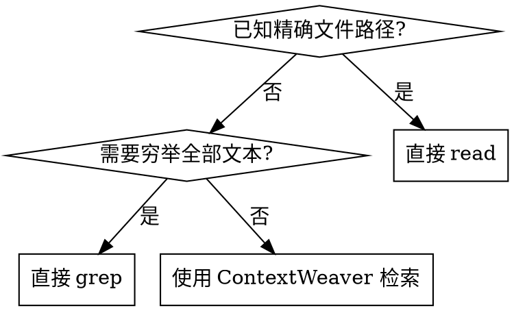

# 使用 ContextWeaver

## 概述

这个 Skill 用来先建立“代码地图”，再决定下一步读哪里、改哪里。它适合回答“这段行为是怎么实现的”，不适合替代精确文件阅读，也不适合做全文穷举。

核心原则：

- 把真正想理解的行为写进 `information-request`
- 只把 100% 确定存在的标识符放进 `technical-terms`
- 命中关键结果后，立刻转去 `read`
- 如果目标是“找全所有出现位置”，改用 `grep`

## 何时使用



适合：

- 不知道准确文件路径，但知道想理解的功能或流程
- 改代码前，先定位相关类、函数、入口和约束
- 围绕一个已知符号，理解它在仓库里的上下文

不适合：

- 已经知道只需要看 1-3 个明确文件
- 任务要求“全部出现位置”“总数”“逐个引用”
- 只是查某个固定字符串、命令字面量或配置键

## 查询写法

### `information-request`

写完整自然语言，重点描述“怎么工作”“如何处理”“流程如何衔接”。

好例子：

- `提示词增强相关逻辑目前是如何触发、拼装模板并返回结果的？`
- `当前 CLI 搜索命令如何接入语义检索核心，并将结果格式化输出？`

避免：

- 只写文件名、目录名、零散关键词
- 一次塞多个互不相关的问题

### `technical-terms`

这是硬过滤，只放你 100% 确定存在的精确标识符。

可以放：

- `SearchService`
- `enhancePrompt`
- `handleCodebaseRetrieval`

不要放：

- 猜测的符号名
- 文件路径，如 `src/index.ts`
- 命令字面量，如 `contextweaver search`

## 使用步骤

1. 先写 `information-request`
2. 如果有少量确定符号，再补 `technical-terms`
3. 调用本地脚本：

```bash
node skills/using-contextweaver/scripts/search-context.mjs \
  --repo-path /abs/path/to/repo \
  --information-request "提示词增强相关逻辑目前是如何触发、拼装模板并返回结果的？" \
  --technical-terms SearchService,enhancePrompt
```

默认输出 JSON，方便 agent 稳定消费结构化字段；需要人工排查时可显式追加 `--format text`。

4. 如果脚本输出 JSON，先看最相关的 `files[].path` 和 `segments[].breadcrumb`
5. 命中关键结果后转去 `read`

## 快速参考

| 目标                        | 做法                                                      |
| --------------------------- | --------------------------------------------------------- |
| 理解一个功能如何实现        | 人类直接用 `contextweaver search`，脚本用 `--format json` |
| 已知精确文件路径            | 直接 `read`                                               |
| 想找全某个字符串            | 直接 `grep`                                               |
| 让其他 Skill 自动拿语义证据 | 调 `search-context.mjs`                                   |

## 常见误判

| 误判                               | 更好的做法     |
| ---------------------------------- | -------------- |
| 已经知道文件路径，还先做语义检索   | 直接 `read`    |
| 把文件路径塞进 `technical-terms`   | 只放真实标识符 |
| 需要穷举结果，还继续做语义检索     | 直接 `grep`    |
| 命中后继续堆更多搜索，而不去读文件 | 先转 `read`    |

## 警讯

- “我大概知道名字，先塞进 `technical-terms` 试试”
- “我已经知道要看哪个文件，但还是先搜一遍”
- “我需要所有结果，语义检索应该也差不多”

出现这些念头时，先停一下，重新判断是不是该用 `read` 或 `grep`。
